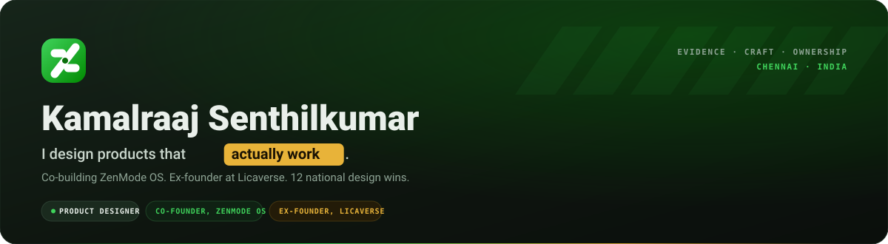
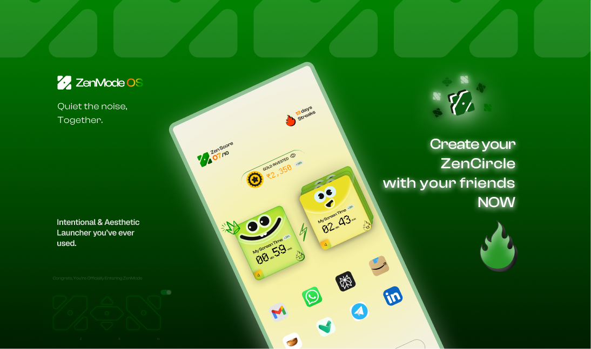
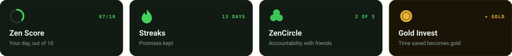
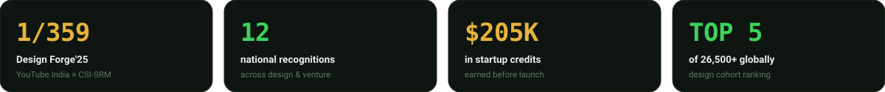
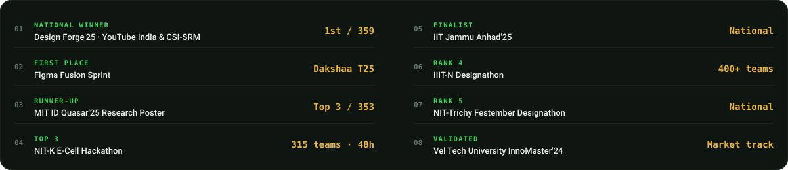
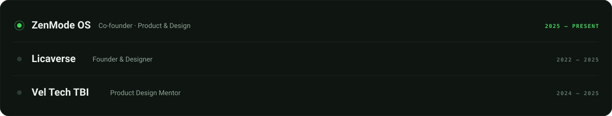
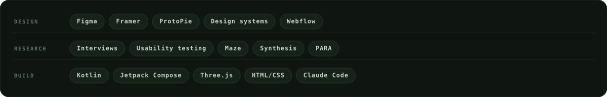

 

**I design products that actually work.**

I organize mess into masterpieces, run ventures like orchestrating a family wedding,
and research users until the truth gets interesting. Right now I'm co-building
**[ZenMode OS](https://github.com/Kamal007OLica/zenmode)** — an open-source Android launcher
that helps people scroll less, *together*.

`Evidence before decoration` · `Chennai, India` · `Available for the right problem`

 

<h3><code>&nbsp;01&nbsp;</code>&nbsp;&nbsp;What I'm <i>building</i></h3>

**ZenMode OS** turns your home screen into a calm space built around intent.
It doesn't lock you out. It adds a small pause at the moments you tend to lose time,
and makes keeping your screen-time promise something you do **together with friends**.

Started at <b>India FOSS United 2025</b>, where I met my co-founder · Kotlin + Jetpack Compose · Issues and PRs welcome

 

<b>More things I've built</b>

 

| | Project | What it is |
|---|---|---|
| **Licaverse** | [repo](https://github.com/Kamal007OLica/Lica_AI-Learning-Assistant) | A learning OS designed from founder thesis to launch — AI assistant, with an IoT ecosystem planned |
| **Uki AI** | [repo](https://github.com/Kamal007OLica/Uki_AI_UI_Auditor_FigmaPlugin) | Figma plugin that audits designs for accessibility, consistency and best practice |
| **Folio** | [live ↗](https://kamal007olica.github.io/folio-book-3d/) | An interactive 3D hardcover portfolio — page-turn physics and procedurally synthesized paper audio |
| **Gemsy** | — | Making professional networking feel less transactional |
| **Xflows** | — | A calmer time tracker built around visible momentum |
| **W3Share** | [repo](https://github.com/Kamal007OLica/W3share) | Decentralized file storage on IPFS + blockchain |
| **Penpot** | [contributions](https://github.com/Kamal007OLica/Design-contribution) | Open-source design-tool UX: workflows, scaling, visual consistency |
| **GHMC routing** | [repo](https://github.com/Kamal007OLica/GHMC-Vechicle-routing) | 18 clusters, 108 trips, ~666 tonnes of waste over 880 km — optimized |

 

<h3><code>&nbsp;02&nbsp;</code>&nbsp;&nbsp;Proof, not <i>personality</i></h3>

Awards aren't the goal. They're external evidence that the research, storytelling and craft connected with people.

 

 

 

<b>VENTURE LEVERAGE</b> — non-dilutive support earned before launch, extending runway for product discovery and infrastructure.

 

 

<h3><code>&nbsp;03&nbsp;</code>&nbsp;&nbsp;Where I've <i>been</i></h3>

 

<h3><code>&nbsp;04&nbsp;</code>&nbsp;&nbsp;How I <i>design</i></h3>

- **Evidence before decoration.** Research keeps the work honest; craft is what helps people trust it. I move from listening and framing into systems, prototypes, validation, and measured shipping — a repeatable 10-step path, not a vibe.
- **Organize mess into masterpieces.** Most product problems are legibility problems. A PARA-inspired second brain keeps research, decisions and unfinished ideas findable at the moment they matter, so knowledge compounds instead of disappearing into tabs.
- **Make the wrong thing hard to do.** Guardrails beat discipline. One source file for colour and type, a component library that refuses off-system values, documentation that makes quality repeatable rather than heroic.
- **Design the venture, not just the screen.** Thesis, market validation, pricing and runway are design surfaces too. The polished screens matter; the decisions behind them matter more.

 

<h3><code>&nbsp;05&nbsp;</code>&nbsp;&nbsp;Toolbox</h3>

 

 

