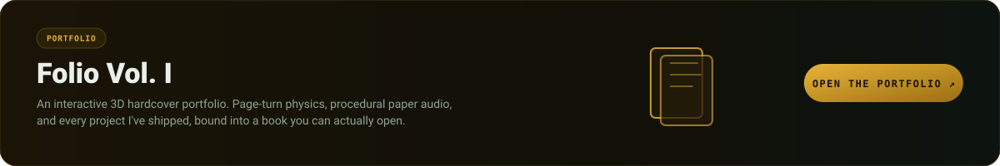
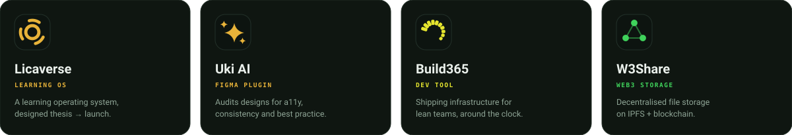
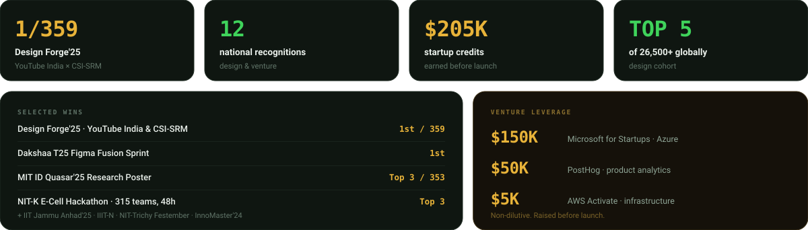

<h3><code>&nbsp;01&nbsp;</code>&nbsp;&nbsp;What I'm <i>building</i></h3>

**ZenMode OS** turns your home screen into a calm space built around intent.
It doesn't lock you out — it adds a pause where you tend to lose time,
and makes keeping your screen-time promise something you do **with friends**.

Began at <b>India FOSS United 2025</b>, where I met my co-founder · Kotlin + Jetpack Compose · open source

<h3><code>&nbsp;02&nbsp;</code>&nbsp;&nbsp;Products I've <i>shipped</i></h3>

<a href="https://github.com/Kamal007OLica/Lica_AI-Learning-Assistant">Licaverse</a> ·
<a href="https://github.com/Kamal007OLica/Uki_AI_UI_Auditor_FigmaPlugin">Uki AI</a> ·
Build365 ·
<a href="https://github.com/Kamal007OLica/W3share">W3Share</a>
&nbsp;&nbsp;|&nbsp;&nbsp; also
<a href="https://github.com/Kamal007OLica/Design-contribution">Penpot contributions</a> ·
<a href="https://github.com/Kamal007OLica/GHMC-Vechicle-routing">GHMC route optimisation</a>

<h3><code>&nbsp;03&nbsp;</code>&nbsp;&nbsp;Proof, not <i>personality</i></h3>

<h3><code>&nbsp;04&nbsp;</code>&nbsp;&nbsp;How I <i>work</i></h3>

 

> **Evidence before decoration.** Research keeps the work honest; craft is what makes people trust it.
> I move from listening and framing into systems, prototypes, validation, and measured shipping —
> a repeatable path, not a vibe. Guardrails beat discipline, and the venture is a design surface too.

 

